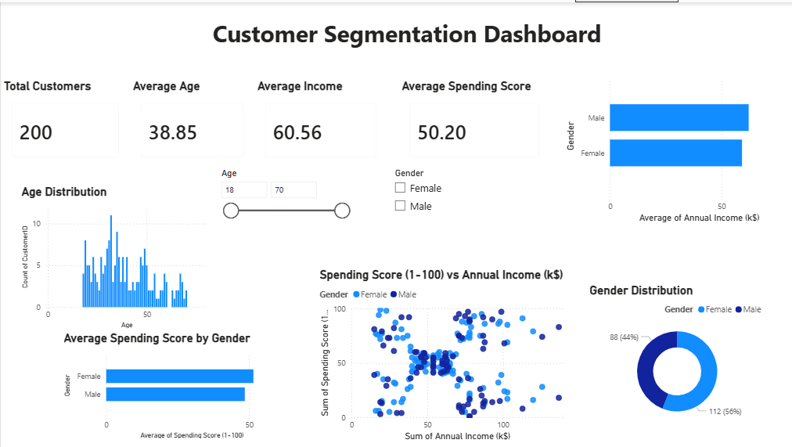

# Customer Segmentation Dashboard

## 📌 Project Overview

This project focuses on customer segmentation using SQL and Power BI. The dataset was cleaned, analyzed, and visualized to uncover customer behavior based on age, gender, annual income, and spending score.

The dashboard helps businesses better understand customer demographics and purchasing patterns for data-driven decision-making.

---

## 📊 Dashboard Preview

---

## 🎯 Objectives

- Analyze customer demographics.
- Compare spending behavior by gender.
- Explore the relationship between annual income and spending score.
- Build an interactive dashboard using Power BI.

---

## 🛠 Tools & Technologies

- Microsoft Excel
- SQL Server
- Power BI
- DAX
- Power Query

---

## 📂 Dataset

The dataset contains customer information including:

- Customer ID
- Gender
- Age
- Annual Income (k$)
- Spending Score (1–100)

---

## 📈 Dashboard Features

### KPI Cards
- Total Customers
- Average Age
- Average Annual Income
- Average Spending Score

### Charts
- Age Distribution
- Gender Distribution
- Spending Score vs Annual Income (Scatter Chart)
- Average Spending Score by Gender
- Average Income by Gender

### Filters
- Gender Slicer

---

## 🔍 Key Insights

- Total Customers: **200**
- Average Age: **38.85 Years**
- Average Annual Income: **60.56 k$**
- Average Spending Score: **50.20**
- Female customers slightly outnumber male customers.
- Spending behavior varies across different income levels.
- Customer segmentation becomes easier using income and spending patterns.

---

## 📁 Project Files

- Customer_Segmentation.xlsx
- Customer_Segmentation.csv
- Customer_Segmentation.sql
- Customer_Segmentation_Dashboard.pbix
- Customer_Segmentation_Dashboard.png

---

## 🚀 Skills Demonstrated

- Data Cleaning
- SQL Queries
- Data Analysis
- Data Visualization
- Dashboard Design
- KPI Development
- Power BI
- Power Query
- DAX Basics

---

## 📬 Contact

If you have any questions or suggestions, feel free to connect with me on LinkedIn.

---

⭐ If you found this project useful, consider giving it a star.
